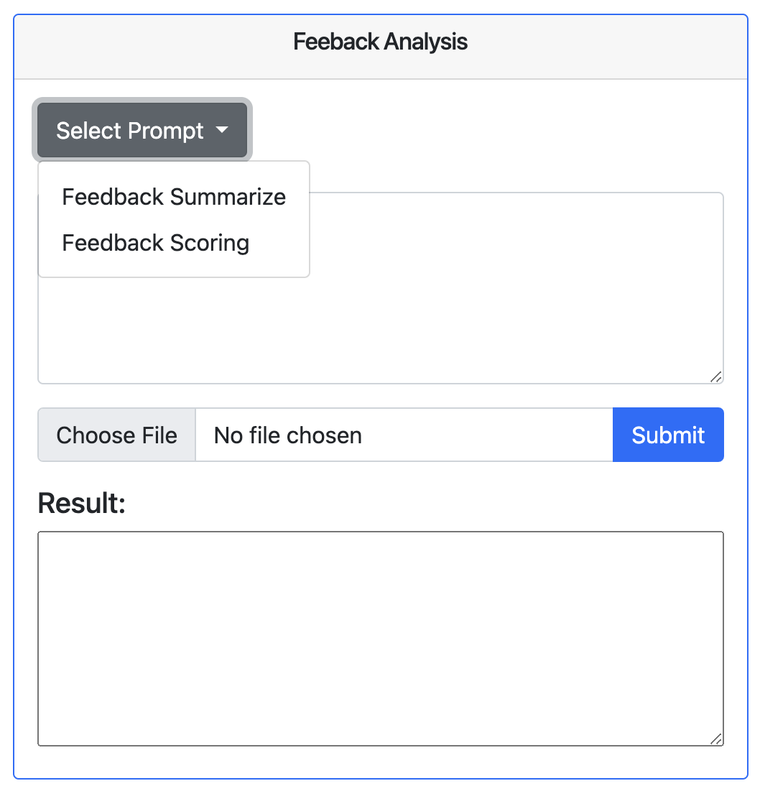
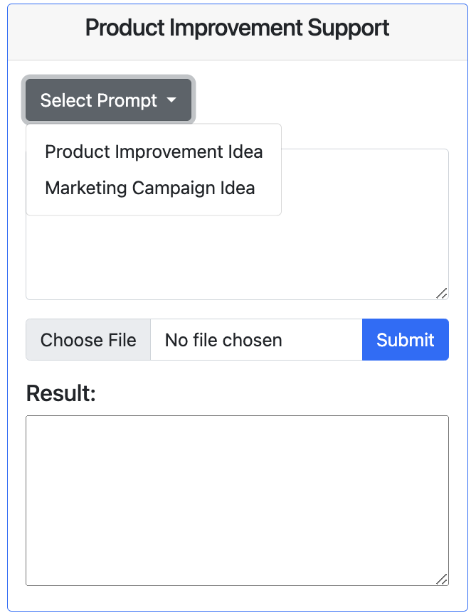

# Project_GPT
This project is a proposed solution for Maybelline upcoming problem which is developing new product.
This project aiming to support the brand on collecting and utilizing availabel data, and leveraging AI for decision support
## Below is the installation guide for this project
1. Clone this repository
2. Open terminal and run the bellow command to install dependencies:
    $ pip install -r requirements
3. Run run.web.py to instantiate the backend
4. Navigate to templates folder and run index.html to start the interface

# Example usage
## Charts
All the chart within the website are interactive and filter are available.

## GPT usage sample
There 2 main tasks: Feedback Analysis and Product Improvement Support
### Feedback Analysis
The user first choose the sub-task want to perform

The user can either enter manually or upload a sample file which is provided inside the folder data_for_demo, then click Submit

### Product Improvement Support

The procedure is the same with this task, user either enter a description of existing product, ask questions relating
to the chosen sub-task or upload a sample description we provided.
